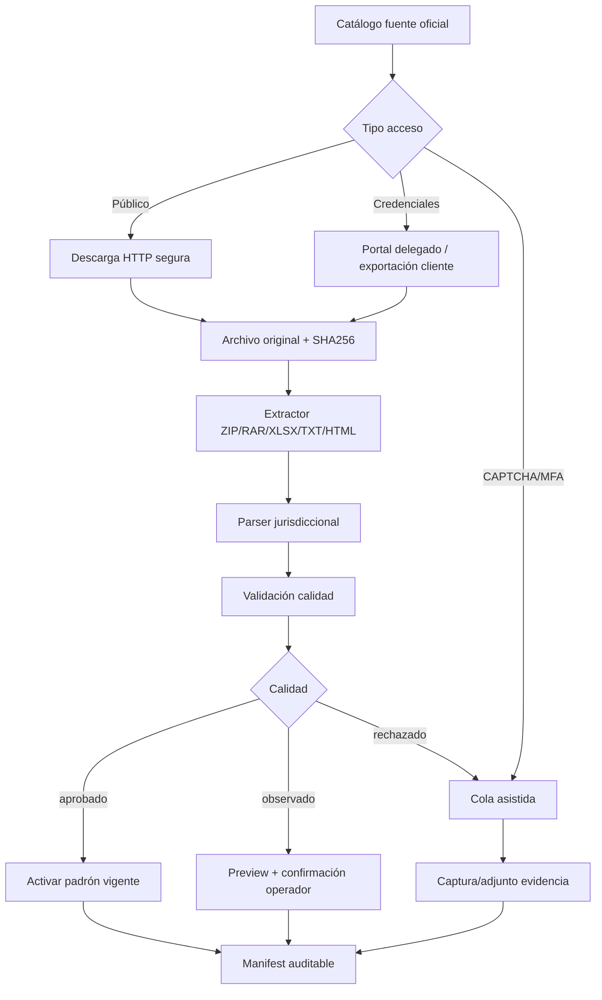

# Fuentes oficiales de padrones fiscales argentinos

Estado: 2026-05-26  
Alcance: padrones de inscripción, agentes de retención/percepción/recaudación, regímenes de información y evidencias necesarias para legajo fiscal auditable.

## Criterio operativo

1. Usar sólo fuentes oficiales: ARCA, Comisión Arbitral/COMARB, administraciones tributarias provinciales y municipios.
2. No calcular alícuotas en esta etapa: descargar, normalizar, evidenciar, clasificar aplicabilidad y mantener actualizado.
3. No eludir CAPTCHA, MFA ni controles de portales. Si la fuente no permite descarga técnica segura, usar cola asistida.
4. Conservar siempre el archivo original o captura oficial, hash SHA256, URL, fecha/hora, período, vigencia, layout detectado y resultado de calidad.
5. Separar credenciales por cliente/agente. No usar credenciales globales ni guardar secretos planos.

## Clasificación técnica de acceso

| Tipo | Uso | Automatización permitida |
|---|---|---|
| `api_oficial` | Web service/API documentado | Integración directa con certificado/token y logs. |
| `padron_descargable` | Archivo público o descargable por agente | HTTP seguro si es público; portal autenticado si requiere clave. |
| `consulta_online` | Consulta por CUIT o portal web | Adaptador por CUIT si no hay CAPTCHA; si hay interacción, cola asistida. |
| `portal_credenciales` | Clave fiscal/CIT/portal agente | Automatización sólo con delegación expresa, secrets cifrados y evidencia. |
| `portal_captcha` | Portal con CAPTCHA | No automatizar el CAPTCHA; tarea asistida con captura. |
| `cola_asistida` | Fuente fragmentada/no estándar | Instrucciones operativas + adjunto de evidencia. |

## P0 — Integración prioritaria

| Fuente | Link oficial | Requisitos | Estrategia |
|---|---|---|---|
| ARCA Constancia de Inscripción | https://www.afip.gob.ar/ws/ | CUIT representante, certificado/clave o proveedor AFIPSDK, servicio de constancia | Mantener integración live/demo; guardar respuesta normalizada y timestamp. |
| ARCA SIRE | https://arca.gob.ar/sire/ | Clave fiscal, servicio SIRE habilitado/delegado | Catalogar como portal con credenciales; integrar evidencias, certificados y acuses antes de automatizar presentación. |
| ARCA APOC / facturación | https://www.arca.gob.ar/facturacion/default.asp | CUIT proveedor; servicio vigente según disponibilidad | Relevar endpoint; si requiere navegador/CAPTCHA, cola asistida. |
| ARBA Régimen por Sujeto | https://web.arba.gov.ar/regimen-de-recaudacion-por-sujeto | CIT/credencial de agente; puede autorizar terceros; descarga ZIP mensual | Integrar como P0 autenticado: ZIP original, TXT ret/per, parser ARBA, comparación mensual. |
| AGIP/CABA padrón contribuyentes | https://imagenes.agip.gob.ar/agentes/agentes-de-recaudacion/ib-agentes-recaudacion/padrones/ag-rec-padron-contribuyentes | Fuente pública con archivos de vigencia | Mantener parser RAR/TXT; agregar monitor de links y vigencia. |
| ATER Entre Ríos padrón alícuotas | https://www.ater.gob.ar/ater2/PadronAlicuotas.asp | Fuente oficial pública o exportación del portal según período | Agregar monitor HTTP y parser específico. |
| Santa Fe PARP | https://www.santafe.gov.ar/index.php/web/content/view/full/259270/%28subtema%29/102284 | CUIT + clave fiscal ARCA, servicio API Santa Fe/SIAT habilitado | Portal credenciales; descarga/exportación asistida inicial. |
| COMARB SIRCREB | https://www.ca.gob.ar/index.php/sistemas/sircreb | Clave fiscal ARCA; módulo agentes/contribuyentes | Portal Federal/COMARB; descargar padrón mensual si el agente tiene acceso. |
| COMARB SIRCUPA | https://www.ca.gob.ar/sistemas/sircupa | Clave fiscal ARCA; módulo agentes/contribuyentes | Igual SIRCREB; PSP/cuentas de pago. |
| COMARB SIRCIP | https://www.ca.gob.ar/sistemas/sircip | Portal Federal Tributario | FAQ oficial indica padrón mensual en “Descargas”, días previos al inicio de cada mes. |

## P1 — Provincias y COMARB complementario

| Fuente | Link oficial | Requisitos | Estrategia |
|---|---|---|---|
| COMARB SIRCAR | https://www.ca.gob.ar/sistemas/sircar | Clave fiscal/portal agente | Portal credenciales; integrar como evidencia/acuse y padrón si exportable. |
| COMARB SIRTAC | https://www.ca.gob.ar/sistemas/sirtac | Clave fiscal/portal agente | Relevamiento de módulo agentes y descargas. |
| COMARB Padrón Web/SIFERE | https://www.ca.gob.ar/sistemas/padron-web-padron-federal | Clave fiscal; contribuyente CM | Evidencia de inscripción CM/constancia. |
| Córdoba | https://www.rentascordoba.gob.ar/cms/ca/agentes/ | Portal Rentas/CiDi según servicio; algunas consultas públicas | Mantener parser ZIP/headerless; relevar consulta de alícuotas por CUIT. |
| Jujuy | https://rentasjujuy.gob.ar/agentes-ingresos-brutos/ | Página oficial con régimen/padrón; puede exponer XLSX | Mantener parser XLSX; monitor de publicación mensual. |
| Tucumán | https://www.rentastucuman.gob.ar/nomina/rentastuc2/padrones_nominas/ | Algunas consultas públicas; padrón contribuyentes con clave fiscal | Mantener parser CSV/TXT; CAPTCHA/clave a cola asistida. |
| Mendoza | https://atm.mendoza.gov.ar/portalatm/zoneTop/preguntasFrecuentes/sircar/sircar.jsp | Portal ATM/SIRCAR, credenciales | Descargar/exportar con autorización; evidencia portal. |
| Misiones | https://atmisiones.gob.ar/ingresos-brutos/ | Consulta pública + autogestión clave fiscal | Adaptador por CUIT donde sea público; credenciales a cola asistida. |
| Corrientes | https://www.dgrcorrientes.gov.ar/rentascorrientes/consultarContenido.do?categoria=199 | Usuario registrado/CAV | Consulta de alícuotas desde Portal del Contribuyente > IIBB Agentes. |
| Río Negro | https://agencia.rionegro.gov.ar/index.php?contID=55175 | Portal Agencia; posibles consultas con CAPTCHA | Cola asistida si hay CAPTCHA; integrar sólo evidencias. |
| Chubut | https://www.dgrchubut.gov.ar/agentes-de-retencion-y-percepcion/ | Fuente pública HTML/PDF | Scrape seguro de nóminas y certificados; guardar HTML/PDF original. |

## P2 — Resto país a relevar

| Jurisdicción | Link base oficial | Condición actual | Próxima acción |
|---|---|---|---|
| Catamarca | https://arcat.gob.ar/ | Pendiente de identificar padrón/consulta específica | Relevar agentes IIBB, alícuotas y COT/ARBA si aplica. |
| Chaco | https://atp.chaco.gob.ar/ | Pendiente | Relevar ATP agentes, constancia y padrones descargables. |
| Formosa | https://www.formosa.gob.ar/tramite/120/inscripcion_como_agente_de_percepcion_del_impuesto_sobre_los_ingresos_brutos | Trámite oficial identificado; sin padrón público confirmado | Mantener archivo/exportación cliente. |
| La Pampa | https://www.dgr.lapampa.gob.ar/ | Pendiente | Relevar portal DGR/ATM y requisitos de agentes. |
| La Rioja | https://dgip.larioja.gob.ar/ | Pendiente | Relevar DGIP agentes IIBB. |
| Salta | https://www.dgrsalta.gov.ar/ | Pendiente | Relevar DGR agentes, alícuotas y consulta CUIT. |
| San Juan | https://rentas.dgrsj.gob.ar/ | Pendiente | Relevar Rentas agentes IIBB. |
| San Luis | https://dpip.sanluis.gov.ar/ | Pendiente | Relevar DPIP agentes/constancias. |

## P3 — Baja prioridad inicial / municipal

| Fuente | Link oficial | Estrategia |
|---|---|---|
| Neuquén | https://rentasneuquenweb.gob.ar/nqn/SCF/cons_inscripcion.php | Ya catalogada como consulta por CUIT; mantener evidencia por alta/revalidación. |
| Santa Cruz | https://asip.gob.ar/ | Relevar portal y agentes sólo si aparece en huella de cliente. |
| Santiago del Estero | https://www.dgrsantiago.gov.ar/ | Relevar por demanda/cliente. |
| Tierra del Fuego | https://www.aref.gob.ar/ | Relevar por demanda/cliente. |
| Municipios | https://www.argentina.gob.ar/municipios | No intentar cobertura masiva. Priorizar por domicilio/sucursales/volumen del cliente. |

## Pipeline recomendado

## Modelo canónico destino

Campos mínimos por registro normalizado:

- `fuente_id`
- `jurisdiccion`
- `organismo`
- `tipo_padron`
- `periodo`
- `vigencia_desde`
- `vigencia_hasta`
- `cuit`
- `razon_social`
- `condicion`
- `regimen`
- `alicuota_retencion` opcional, sin cálculo automático en esta etapa
- `alicuota_percepcion` opcional, sin cálculo automático en esta etapa
- `fuente_url`
- `sha256_origen`
- `parser_version`
- `calidad_estado`

## Backlog técnico

1. P0 público/autenticado:
   - ARBA ZIP/TXT retención/percepción.
   - AGIP monitor de links.
   - ATER descarga/parser.
   - COMARB/Santa Fe como flujo con credenciales/cola asistida.
2. P1:
   - Córdoba/Jujuy/Tucumán: consolidar parsers existentes y monitores.
   - Chubut HTML/PDF.
   - Misiones/Corrientes/Río Negro: consulta por CUIT o cola asistida.
3. P2:
   - Relevamiento asistido de portales restantes con evidencia.
4. P3:
   - Municipios por huella del cliente, no por cobertura nacional indiscriminada.
